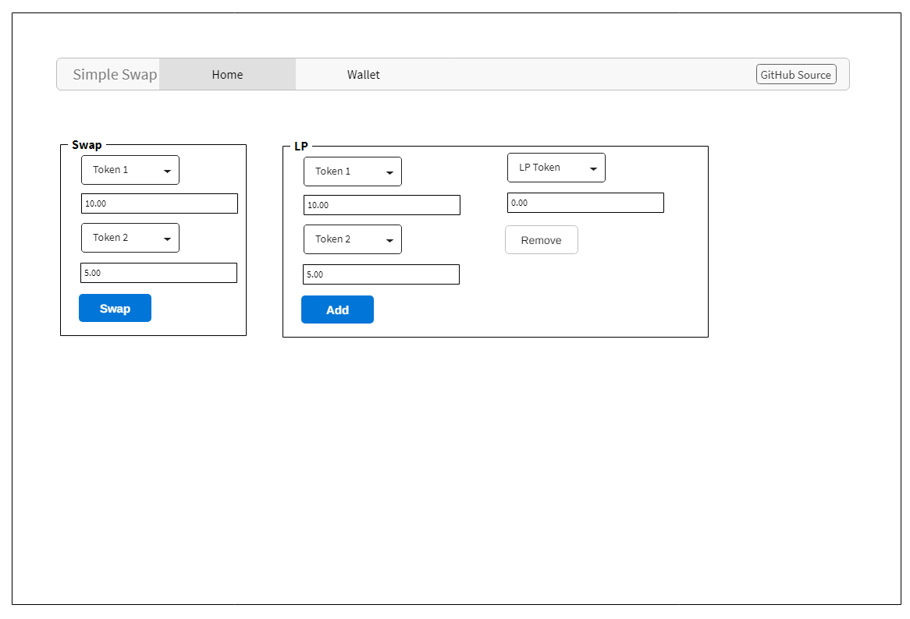
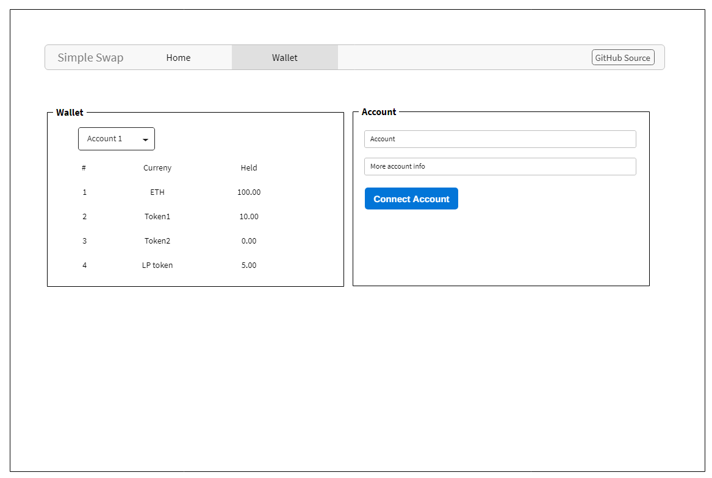

# Simple Swap

## Project Description

A [Uniswap V1](https://github.com/Uniswap/uniswap-v1) clone for decentralized automated token exchange on Ethereum. React frontent links to smart contracts on the local Ethereum blockchain to allow for providing liquidity and swapping `ETH`/tokens.

<!-- Use this section to describe your final project and perhaps any links to relevant sites that help convey the concept and\or functionality. -->

TODO: [CodeSandbox Link]() to be added for frontend when completed.

## Setup

TODO: update as project proceeds.

-   Clone the project:

    ```
    git clone https://github.com/nefrob/rctr-final-project.git
    cd rctr-final-project
    ```

-   Install dependencies:

    ```
    npm install
    ```

-   Run blockchain: (initializes two accounts with `5000 ETH` each):

    ```
    npm run ganache
    ```

    It is convienent to run the local blockchain deterministically for testing. To do so use:

    ```
    npm run ganache-det
    ```

-   With `ganache` running, you can compile and deploy the contracts with:

    ```
    npm run migrate
    ```

-   Setup and run the React Dapp from the `client` directory:

    ```
    cd client
    npm install
    npm start
    ```

## Design

#### Wireframes

-   `/home`:

    

-   `/wallet`:

    

[Uniswap V1](https://app.uniswap.org/#/swap) page for reference.

#### Components

TODO: expand as app progresses.

| Component  |       Description        |
| ---------- | :----------------------: |
| App        |          Setup           |
| Home       |       Landing page       |
| Navigation |      Render header       |
| Swap       |     Swapping tokens      |
| LP         |   Add/remove liquidity   |
| Wallet     | Display current holdings |

#### MVP

-   Home page
-   Swap page
-   ~~Liquidity pool page~~
-   ~~Wallet page with currennt ETH balance and a button to connect to a wallet~~

#### PostMVP

-   ETH/token exchange prices in USD (use API)
-   ~~Integration with MetaMask~~
-   ~~Add new token to wallet functionality~~
-   Integration with Ethereum testnet
    -   Integration with Codesandbox

## API

To make swap prices easier to understand, the current `ETH` value in `USD` will be fetched from [CEX Rest API](https://cex.io/rest-api).

Example request: `https://cex.io/api/last_price/ETH/USD` returns:

```
{
  "lprice": "3400.36",
  "curr1": "ETH",
  "curr2": "USD"
}
```

## Additional Libraries

-   `web3.js` for interaction with ethereum nodes.
-   `truffle` for testing and deployment of contracts.
-   `ganache` for local Ethereum blockchain testing.
-   `@openzeppelin/contracts` for ERC standards and smart contract libraries.
-   `react-boostrap` for styling.

## Other

TODO:

<!-- #### Code Snippet

Use this section to include a brief code snippet of functionality that you are proud of an a brief description. Code snippet should not be greater than 10 lines of code.

```
function reverse(string) {
	// here is the code to reverse a string of text
}
``` -->
